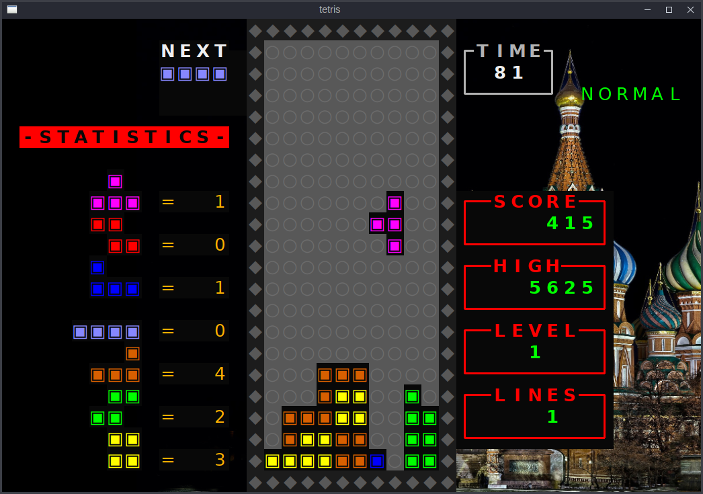
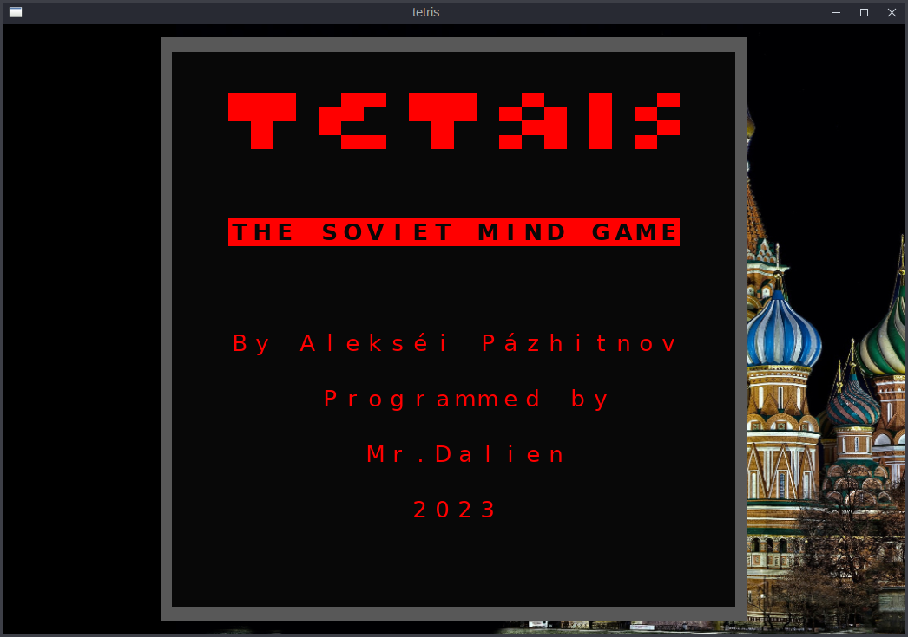
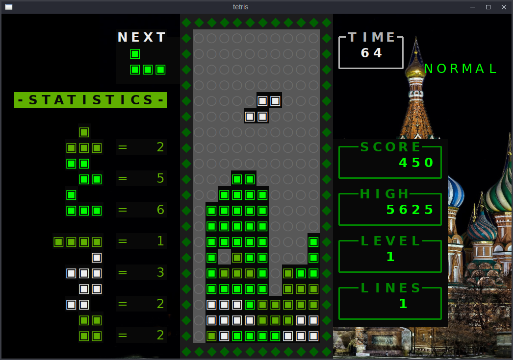
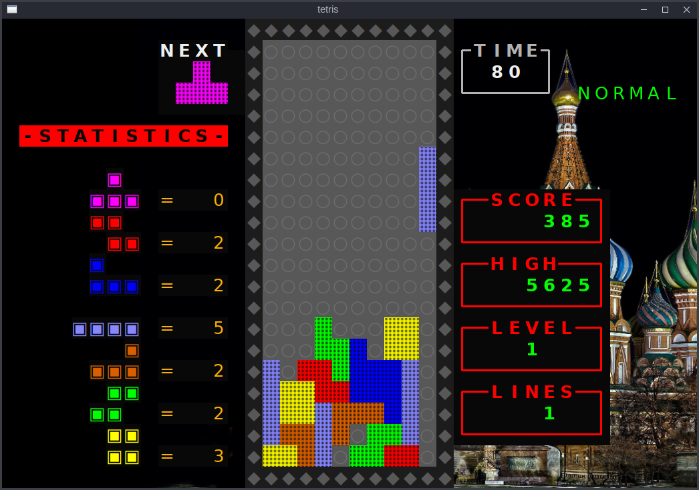
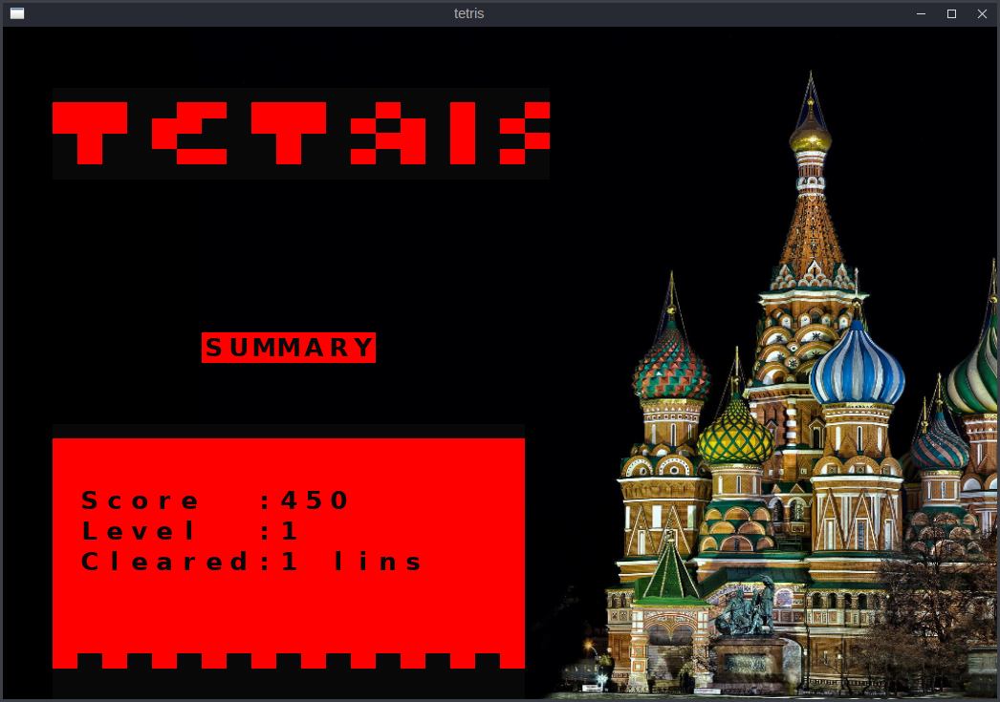
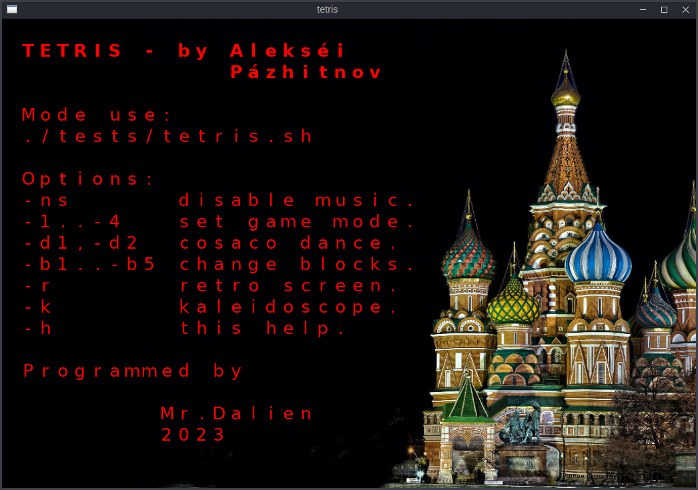

<!--  -->

    

# Tetris
Tetris - clasical game made with Gadget library for C-Linux Debian and derivatives.

Para jugar, debe tener instalada la librería Gadget y compilar. Luego, el juego es un ejecutable independiente de la librería, si se compila con la opción "-static".

# Requisitos.

Debe tener instalada la librería GADGET para GCC de Linux (Debian y sus derivados Ubuntu, Mint, etc).

Debe tener instalados el terminal RXVT, y los programas APLAY y XSET (aunque estos últimos creo que ya vienen de facto).

Con APLAY ejecuto los efectos de sonido y la música de fondo.

Con XSET redefino el delay y el rate del teclado, para una mejor experiencia de juego.

# Compilación.

     ./ccpre.sh <directorio>/tetris -static

# Ejecución.

     ./<directorio>/tetris.sh [opciones]

Ver las opciones en el screenshot de más abajo.

# Screenshots.

